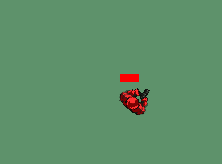

# *Semestrální projekt PJV* - The Lost One, RPG Room Adventure

Autorem je [Martin Černý](https://www.linkedin.com/in/martin--cerny/), ČVUT FEL SIT, 2023

## Kapitoly README
1. [Přehled projektu](#1-přehled-projektu)
2. [Ovládání](#2-ovládání-jak-hru-spustit)
    1. [Spuštění hry](#21-spuštění-hry)
    2. [Ovládání, klávesy](#22-ovládání-klávesy)
    3. [Logika hry](#23-logika-hry)
    4. [Uložení hry](#24-uložení-hry)
    5. [Otevření uložené hry](#25-otevření-uložené-hry)
    6. [Jak číst soubor uložené hry](#26-jak-číst-soubor-uložené-hry)
3. [GUI](#3-gui)
4. [Implementace](#4-technická-implementace)
    1. [JavaDoc](#41-javadoc)
    2. [Struktura aplikace](#42-struktura-aplikace)
    3. [Design projektu](#43-design-projektu)
    4. [Použité technologie](#44-použité-technologie)
    5. [Page Object Model](#45-page-object-model)
    6. [Zdroje](#46-zdroje) 

## 1. Přehled projektu
Projekt je RPG hra nazvaná *The Lost One*. Je to RPG Room únikovka.
Cílem hry je postupně se jako ztracený průzkumník dostat k fontáně, ve 
které se skrývá tajný východ z katakomb.
Na cestě jsou ale na hráče připraveny vlny protivníků, 
které se hráči snaží jakkoliv zabránit dostat se k fontáně.

Na projektu jsem celkově strávil 96 hodin čistého vývoje. 
V commitech si můžete prohlédnout díky dddonu od vývojáře Jana Poláka na sledování času prohlédnout, kolik času mi jaký commit zabral.

## 2. Ovládání, jak hru spustit
Projekt má dvě hlavní okna, *Launcher* a *GameWindow*.

### 2.1 Spuštění hry
V okně *Launcher* máte dvě možnosti, buď Zapnout menší, defaultní hru, nebo si můžete vybrat svoji vlastní, nebo uloženou mapu. 
Doporučuji otevřít si mapu *BiggerTestMap.txt*, která se nachází v 
adresáři /resources/map/.
Poté se vám otevře GameWindow se samotnou hrou.
### 2.2 Ovládání, klávesy
Na začátku se jako hráč spawnete většinou v úvodní roomce. Zpravidla máte na 
začátku lehkou zbraň - pistoli.

Pohybujete se klávesami *šipkami*.

Střílíte stiskem tlačítka *M*.

Pokud máte více zbraní, přepínáte je pomocí tlačítka *N*.

Klávesa *Escape* Vám umožní přepnout se do herního menu.

Zbraň seberete pomocí klávesy *I*.

Zbraň zahodíte pomocí klávesy *O*.

### 2.3 Logika hry
Roomky jsou zamčené, dokud neporazíte všechny vojáky a věže. Poté se odemknou všechny dveře a můžete postoupit dál. Z poražených věží a z vojáků mohou spadnout nějaké lepší zbraně. Ty můžete sebrat. POZOR! Můžete je sebrat pouze dokud neodejdete do jiné roomky.

Modré, vygenerované čtverečky jsou voda, většinou podzemní jezírka. Lze přes ně střílet, ale nelze přes ně chodit.

Hra končí, pokud se Vaše zdraví dostane pod nulu (to jste prohráli), nebo se dostanete k fontáně (to jste vyhráli).

### 2.4 Uložení hry
Po stisknutí klávesy *escape* máme možnost hru uložit. Napište jméno + *.txt* a uložte.

### 2.5 Otevření uložené hry
V launcheru máte možnost otevřít si jakoukoli uloženou hru, dokonce svojí. Stačí ji najít v adresáři.

### 2.6 Jak číst soubor uložené hry
Při ruční úpravě souboru s mapou se řiďte takto:

## 3 GUI
GUI se skládá z několika částí. Jedna z nich je inventář, ve kterém je vidět, jaké zbraně vlastníme. Také tam vidíme zdraví, kadenci zbraně a rychlost pohybu.

Zdraví také můžete sledovat v baru v levém horním rohu.

V pravém horním rohu se zobrazuje FPS counter.

V pravém spodním rohu se zobrazují důležité hráčovy interakce s hrou.

## 4 Technická implementace

### 4.1 JavaDoc
JavaDoc se nachází v repozitáři v adresáři /resources/docs/javadoc/.

### 4.2 Struktura aplikace
Zde jsou stručně popsané třídy a balíčky projektu. Další informace lze najít v JavaDocu, popř. podrobnějších v komentářích v kódu.
#### Package `Controller`
Class `CollisionEntityChecker`

Kontroluje kolize mezi hráčem nebo jinou entitou a projektilem. Obsahuje metody jak pro entity, tak pro hráče.

Class `CollisionTileChecker`

Kontroluje kolize mezi hráčem nebo jinou entitou a poličky. Obsahuje metody jak pro entity, tak pro hráče. Metody to kontrolují pomocí vytvořených obdélníků a jejich intersekcí.

Class `GamePanel`

GamePanel je hlavní třídou řídící chod celé hry. Inicializuje většinu objektů, vykresluje, updatuje.

Class `KeyListener`

Třída která implementuje KeyListener.

Class `Main`

Main. Pomocí argumentu "OFF" při spuštění lze vypnout logging.

Class `RoomMover`

Třída co se stará o přesouvání mezi roomkami voláním metody changeRoom.

#### Package `Model`

#### Subpackage `Entity`
Class `DirectionsEnum`

Obsahuje enum, který je ve většině třídách využíván k určení směru. 

Class `EnemyProjectile`

Třída reprezentující nepřátelské projektily.

Class `EnemySoldier`

Třída reprezentující nepřátelské vojáky.

Class `Entity`

Parent třída všech ostatních entity tříd. Obsahuje základní gettery a proměnné. 

Class `Fountain`

Třída reprezentující fontány.

Class `ObjGun`

Třída, která nahrává obrázky zbraní. Také kontroluje sbírání zbraní.

Class `Player`

Třída reprezentující hráče. Obsahuje většinu akcí namapovaných na tlačítka a metody které spouštějí.

Class `Projectile`

Třída reprezentující projektily hráče.

Class `Rocket`

Třída reprezentující Rakety. Tato třída se liší od projektilu specifickými vlastnostmi rakety, jako např. vybuchování.

Class `Tower`

Třída reprezentující nepřátelské věže.

#### Subpackage `Logic`
Class `Megamind`

Třída, která se stará o výpočty, počítá směrové vektory nutné pro pohyb vojáků a pro střelbu. 

#### Subpackage `Map`
Class `Room` 

Třída držící každou Room.

#### Subpackage `Setuper`
Class `ConfigFileSetup`

Konfigurační třída, která čte z konfiguračního souboru a zapisuje do instance data z něho.

Class `EnemySetup`

Třída načítající textury pro vojáky.

Class `MapSetup`

Třída načítající mapu ze specifikovaného souboru.

Class `ProjectileSetup`

Třída načítající textury pro projektily. Obsahuje také metody které zjišťují, zdali může daná entita vystřelit.

Class `TowerSetup`

Třída načítající textury pro věže.

#### Subpackage `Utils`
Class `HealthBar`

Třida, která vytváří a vykresluje bar se zdravím hráče.

Class `Inventory`

Třída vytvářející inventář pro hráče.

Class `Sound`

Tato třída implementuje zvukové efekty do hry.

Record `Tuple`

Record Tuple drží neaktivní entity, z důvodu jejich efektivního zastavení.

#### Package `View`
Class `ErrorWindow`

Error window se efektivně stará o všechny výjimky v programu.

Class `GameConsole`

GameConsole vypisuje na obrazovku FPS a informativní hlášky spojené s hrou.

Class `GameMenu`

GameMenu je třída implementující herní menu, dostupné klávesou ESC. Běží na jiném vlákně, dokážeme z ní ukládat, resetovat hru a zavřít hru. 

Class `GameWindow`

GameWindow implementuje okno, ve kterém se hra odehrává.

Class `GUIView`

GUIView vykresluje inventář, zbraně v něm a countery zdraví, rychlosti a kadence dané zbraně.

Class `HealthBarEnemyUI`

Implementuje HealthBar pro vojáky.

Class `HealthBarPlayerUI`

Implementuje HealthBar pro Hráče do levého horního rohu.

Class `HealthBarTowerUI`

Implementuje HealthBar pro věže.

Class `Launcher`

Základní spouštěcí okno.

Class `MapView`

Vykresluje mapu pomocí políček.

### 4.3 Design projektu
V průběhu celého vývoje projektu jsem se snažil o smysluplné rozdělení balíčků mezi Controller, 
Model a View v rámci uznávané MVC architektury. Díky tomu se v projektu lze jednoduššeji orientovat.
Projekt samozřejmě využívá metody Objektově orientovaného programování jako enkapsulace, nebo dědičnosti.

Dědičnost se objevuje např. v třídě `Entity` a třídách rozšiřující entity jako např. `EnemySoldier` nebo `Player`.

V rámci projektu také používám Enum, např. `DirectionEnum`.
Také používám Recond pro držení dat souřadnic ukládaných entit: `Tuple`.

V semestrální práci používám dvě vlákna, hlavní, `GameThread` a vlákno řídící menu: `GUIThread`.

Používal jsem při práci JDK 19.

Práce je založená na Java SWING. 
### 4.4 Použité technologie
Při vývoji jsem využil:

#### JUnit testovací prostředí
Pro unit testy.
#### Java.Unit.logging
Pro logování.

Při vývoji jsem využil programy:
#### Jetbrains Intellij Idea 2023.1
Hlavní IDE.
#### Audacity
Pro úpravu zvukových efektů.
#### Piskel
Pro úpravu pixelové grafiky pro textury.
#### InkScape
Pro vytváření nové vektorové grafiky používané v programu.
#### NotePad++
#### FastStoneImageViewer
#### PowerTools

### 4.5 Page Object Model

### 4.6 Zdroje
Použité obrázky jsou buď mé, nebo mají v podrobnostech URL, nebo jsou zdarma z veřejných webů.

Použité Zvuky jsou zdarma z webu FreeSound.org. Zvuk umírání a padání věže je ze hry Age of Empires 2.

Martin Černý, 2023

ČVUT FEL SIT